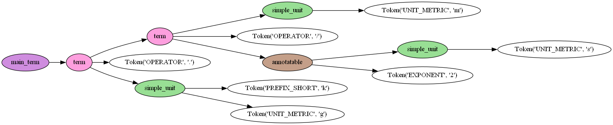

# Easier access to UCUM from Python

> **This is work in progress.** The lark grammar to parse UCUM codes is done.
The transformer is work in progress.
Conversion to pint is broken at the moment.
The conversion must happen term by term during parse tree traversal.
The unit mappings ucum-to-pint must be extended.
For units missing in pint we may need to extend the registry with new aliases or new units.

[UCUM](https://ucum.org/) (Unified Code for Units of Measure) is a code system intended to cover all units of measures.
It provides a formalism to express units in an unambiguous way suitable for electronic communication.
Note that UCUM does non provide a canonical representation, e.g. `m/s` and `m.s-1` are expressing the same unit in two ways.

**ucumvert** is a pip-installable Python package. Features:

- Converter for creating [pint](https://pypi.org/project/pint/) units from UCUM unit strings
- Parser for UCUM unit strings

**ucumvert** generates the UCUM grammar by filling a template with unit codes, prefixes etc. from the official [ucum-essence.xml](https://github.com/ucum-org/ucum/blob/main/ucum-essence.xml) file (a copy is included in this repo). 
So updating the parser for new UCUM releases is straight forward.
The parser is built with the great [lark](https://pypi.org/project/lark/) parser toolkit.
The generated lark grammar file is included in the repository, see [ucum_grammar.lark](https://github.com/dalito/ucumvert/blob/main/src/ucumvert/ucum_grammar.lark).

## Install

Installation from git in developer mode including creation of virtual environment:

Linux
```
git clone https://github.com/dalito/ucumvert.git
cd ucumvert
python -m venv .venv
source .venv/bin/activate
pip install -e .[dev]
```

Windows
```
git clone https://github.com/dalito/ucumvert.git
cd ucumvert
py -m venv .venv
.venv\Scripts\activate.bat
pip install -e .[dev]
```

## Demo

This is just a demo to show that the code does something...

```cmd
(.venv) $ ucumvert
Enter UCUM units to parse, or 'q' to quit.
> m/s2.kg
Created visualization of parse tree (parse_tree.png).
Tree of parsed ucum unit "m/s2.kg":
main_term
  term
    term
      simple_unit       m
      /
      annotatable
        simple_unit     s
        2
    .
    simple_unit
      k
      g
> q
```

So the result is a tree:



Conversion to [pint](https://pint.readthedocs.io/) units must happen term by term as part of the tree traversal. (WIP)

## Tests

The unit tests include a test to parse all common UCUM unit codes from the official repo. To see this run

```cmd
$ pytest
```

The common UCUM unit codes are available only in binary form (xlsx, docs, pdf).
Here we keep a copy in tsv-format `ucum_examples.tsv`.
To (re)generate this tsv-file from the official xlsx-file in the [UCUM repository](https://github.com/ucum-org/ucum/tree/main/common-units) run

```cmd
$ pip install openpyxl
$ python src/src/ucumvert/vendor/get_ucum_example_as_tsv.py
```

## Useful links

- UCUM [online-validator](https://ucum.nlm.nih.gov/ucum-lhc/demo.html)
- Issue in pint that motivated this work: [To what extent is pint compatible with UCUM?](https://github.com/hgrecco/pint/issues/1769)

## License

The code in this repository is distributed under MIT license with the exception of the `ucum-*.*` files in the directory `src/ucumvert/vendor` 
that fall under the [UCUM Copyright Notice and License](https://github.com/ucum-org/ucum/blob/main/LICENSE.md) (Version 1.0).
We consider **ucumvert** according to §1.3 not as "Derivative Works" of UCUM because **ucumvert** only *"interoperates with an unmodified instance of the Work"*.
